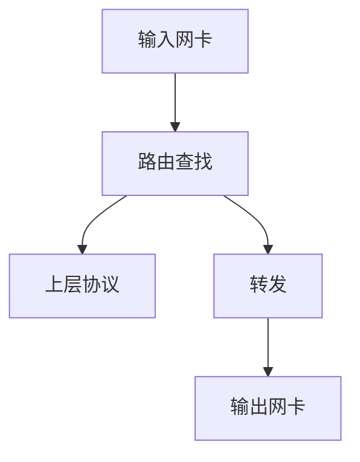
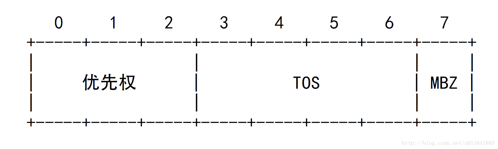

# Linux TC 带宽管理队列规则
### 原理：利用队列（Qdisc）控制数据发送的方式

报文分组从输入网卡接收进来，经过路由查找，已确定是发给本机的，还是需要转发的。如果是发给本机的，就向上递交给上层协议，如TCP，如果是转发的就从输出网卡发出。<b><i>网络流量的控制通常发生在输出网卡处。</i></b>原因是我们无法控制自己网络之外的设备，因此在入口处控制流量较难。
### 基本概念
- 队列：每个网卡都与一个队列相联系，每当内核需要将报文分组从网卡发送出去，都会首先将该报文分组添加到该网卡所配置的队列中，由该队列决定报文分组的发送顺序。
- 队列规则(queuing discipline, qdisc)：队列决定报文分组的发送顺序所依据的规则，即管理设备输入（ingress）和输出（egress）的算法 
### 分类
1. 无类队列规则
> - pfifo_fast
> - 令牌桶过滤器（TBF）
> - 随机公平队列（SFQ）
2. 分类的队列规则
> - PRIO队列规则
> - CBQ队列规则
> - HTB队列规则（分层令牌桶）
> - IMQ（Intermediate queueing device, 中介队列设备）
### 1. 无类队列规则
> 对于无类队列规则来说，网卡对报文不进行类别划分，只进行流量整形，无类队列能够对接收到的数据重新编排，设置延迟和丢包。
- pfifo_fast：（硬性的缺省配置，不能用TC命令对它进行配置）
>> 此规则将收到的数据包按照FIFO的原则进行转发，不对数据包进行任何特殊处理。这个队列有三个频道（band）。FIFO规则应用于每一个频道。并且：如果0频道有数据包等待发送，1频道的包就不会被处理，1频道和2频道之间的关系也是如此。
>>> priomap:
    此规则为内核规则，根据数据包的优先权情况，映射到相应的频道。这个银蛇过程是根据数据包的TOS(Type of Service)字节进行的。
>>> TOS字节的格式：

>>> TOS字节的4个bits定义如下：
  
>>> 频道(band)划分规则如下:
  
>>> tx queuelen: 
队列的长度来自网卡的配置，可用ifconfig和ip命令修改。 
如设置队列长度为10，执行：ifconfig eth0 txqueuelen 10（不能用tc命令设置这个）。

- 令牌桶过滤器(TBF, Token Bucket Filter)
>> 只允许以不超过事先设定的速率到来的数据包通过，但可能允许短暂突发流量超过设定值。

