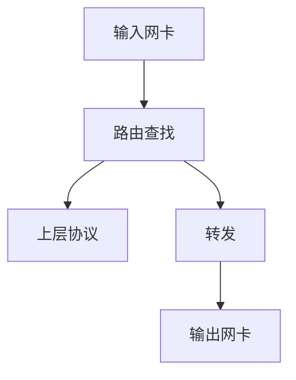

# Linux TC 带宽管理队列规则

### 原理：利用队列（Qdisc）控制数据发送的方式

报文分组从输入网卡接收进来，经过路由查找，已确定是发给本机的，还是需要转发的。如果是发给本机的，就向上递交给上层协议，如TCP，如果是转发的就从输出网卡发出。***网络流量的控制通常发生在输出网卡处。*** 原因是我们无法控制自己网络之外的设备，因此在入口处控制流量较难。

### 基本概念
- 队列：每个网卡都与一个队列相联系，每当内核需要将报文分组从网卡发送出去，都会首先将该报文分组添加到该网卡所配置的队列中，由该队列决定报文分组的发送顺序。
- 队列规则(queuing discipline, qdisc)：队列决定报文分组的发送顺序所依据的规则，即管理设备输入（ingress）和输出（egress）的算法 

### 分类
1. 无类队列规则
    - pfifo_fast
    - 令牌桶过滤器（TBF）
    - 随机公平队列（SFQ）
2. 分类的队列规则
    - PRIO队列规则
    - CBQ队列规则
    - HTB队列规则（分层令牌桶）
    - IMQ（Intermediate queueing device, 中介队列设备）

### 1. 无类队列规则
- **对于无类队列规则来说，网卡对报文不进行类别划分，只进行流量整形，无类队列能够对接收到的数据重新编排，设置延迟和丢包。**
- pfifo_fast：（硬性的缺省配置，不能用TC命令对它进行配置）
    * 此规则将收到的数据包按照FIFO的原则进行转发，不对数据包进行任何特殊处理。这个队列有三个频道（band）。FIFO规则应用于每一个频道。并且：如果0频道有数据包等待发送，1频道的包就不会被处理，1频道和2频道之间的关系也是如此。
    
    * priomap:
    此规则为内核规则，根据数据包的优先权情况，映射到相应的频道。这个映射过程是根据数据包的TOS(Type of Service)字节进行的。
        - TOS字节的格式：<br/>
            
            
        - TOS字节的4个bits定义如下：
            
        - 频道(band)划分规则如下:
            
    
    * tx queuelen: 
        - 队列的长度来自网卡的配置，可用ifconfig和ip命令修改。<br> 如设置队列长度为10，执行：ifconfig eth0 txqueuelen 10（不能用tc命令设置这个）。

- 令牌桶过滤器(TBF, Token Bucket Filter)
    * 只允许以不超过事先设定的速率到来的数据包通过，但可能允许短暂突发流量超过设定值。
    * TBF的实现在于一个缓冲器（桶），该缓冲器（桶）不断地被一些叫做”令牌”的虚拟数据以特定速率(token rate)填充着。桶最重要的参数就是它的大小，也就是它能够存储令牌的数量。
    * *每个到来的令牌从数据队列中收集一个数据包，然后从桶中被删除*。因此这个算法关联在两个流上--令牌流和数据流。
    
    * **令牌桶算法**
        - 目的: 为了防止网络拥塞，限制流出网络的流量，使流量以比较均匀的速度向外发送，并且允许突发数据的发送。
        - 大小固定的令牌桶可以以恒定的速率源源不断地产生令牌，知道令牌充满整个令牌桶，则后面产生的令牌就会被丢弃。即任何时候的令牌数量都不会超过令牌桶的最大容量。
        
        - 三种情况：
            1. **V(数据流) = V(令牌流)，每个到来的数据包都能对应一个令牌，然后无延迟地通过队列；**
            2. **V(数据流) < V(令牌流)，通过队列的数据只能消耗掉一部分令牌，剩下的令牌会在令牌桶中积累下来，知道令牌桶被装满。剩下的令牌可以再需要以高于令牌流速率发送数据流的时候消耗掉，这种情况即为突发传输；**
            3. **V(数据流) > V(令牌流)， 意味着桶内令牌会被很快耗尽，导致TBF中断一段时间，称为越限(overlimit)。如果数据包持续到来，将发生丢包。**
        
        - 参数使用：
            1. limit/latency
                > limit确定最多有多少数据（字节数）在队列中等待令牌。你也可以通过设置latency来指定这个参数，latency参数确定了一个包在TBF中等待传输的最长等待时间。两者计算决定桶的大小、速率和峰值速率。
            
            2. burst/buffer/maxburst
                > 桶的大小，以字节计。这个参数指定了最多可以有多少个令牌能够即刻被使用。通常，管理的带宽越大，需要的缓冲器就越大。在Intel体系上，10Mbit/s的速率需要至少10k字节的缓冲区才能达到期望的速率。如果你的缓冲区太小，就会导致到达的令牌没有地方放（桶满了），这会导致潜在的丢包。

            3. MPU
                > 一个零长度的包并不是不耗费带宽。比如以太网，数据帧不会小于64字节。MPU(Minimum Packet Unit，最小分组单元)决定了令牌的最低消耗。

            4. rate
                > 速度操纵杆，rate = limit/latency
            
            5. peakrate（峰值速率）
                >  如果有可用的令牌，数据包一旦到来就会立刻被发送出去，就像光速一样。那可能并不是你希望的，特别是你有一个比较大的桶的时候。峰值速率可以用来指定令牌以多快的速度被删除。用书面语言来说，就是：**释放一个数据包，然后等待足够的时间后再释放下一个**。我们通过计算等待时间来控制峰值速率。例如：UNIX定时器的分辨率是10毫秒，如果平均包长10kb，我们的峰值速率被限制在了1Mbps。
            
        - 配置范例：
            ```sh
            tc qdisc add dev ppp0 root tbf rate 220kbit latency 50ms burst 1540
            ```

